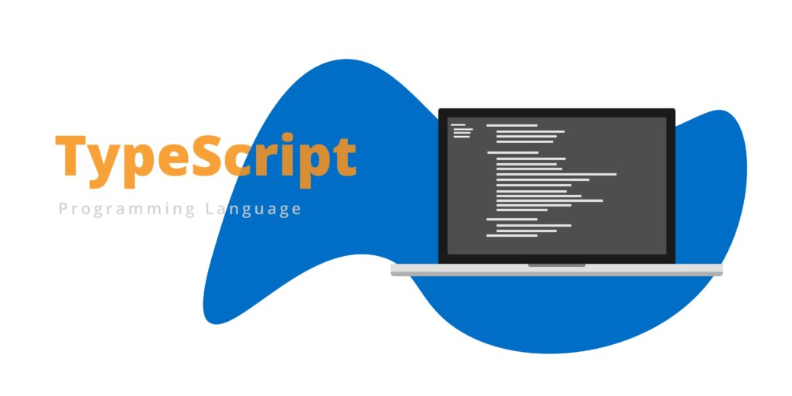

[](https://github.com/WrathChaos/react-native-typescript-library-starter)

[](https://github.com/WrathChaos/react-native-typescript-library-starter)

[](https://www.npmjs.com/package/react-native-typescript-library-starter)
[](https://www.npmjs.com/package/react-native-typescript-library-starter)

[](https://opensource.org/licenses/MIT)
[](https://github.com/prettier/prettier)

<p align="center">
  
</p>

## Library Usage

- `npm i`
- `npm run husky:setup`
- Delete example folder
- Delete build folder
- Make your own library into the `lib` folder
- Change package.json
- Change README for your own documentation
- `npm run build`

```
> react-native-typescript-library-starter@0.1.0 build /Users/kuray/Coursion/MyLibraries/ReactNative/react-native-typescript-library-starter
> cd lib && tsc && cp ../package.json ../build/dist/ && Echo Build completed!

Build completed!
```

- Test your build/dist into the new project
- Finally, time to npm publish :)

### Below part is for Documentation ! Remove above Library Usage

# Installation

Add the dependency:

```bash
npm i react-native-typescript-library-starter
```

## Peer Dependencies

<h5><i>IMPORTANT! You need install them</i></h5>

```js
"react": ">= 16.x.x",
"react-native": ">= 0.55.x",
```

# Usage

## Import

```jsx
import MyComponent from "react-native-typescript-library-starter";
```

## Fundamental Usage

```jsx
<MyComponent />
```

## Example Project 😍

You can checkout the example project 🥰

Simply run

- `npm i`
- `react-native run-ios/android`

should work of the example project.

# Configuration - Props

| Property               | Type                       | Default       | Description                                                                                          |
| ---------------------- | -------------------------- | ------------- | ---------------------------------------------------------------------------------------------------- |
| data                   | ChipType[]                 | []            | An array of chip objects to display                                                                 |
| activeId               | string \| number           | null          | The ID of the currently active chip                                                                  |
| activeBackgroundColor  | string                     | '#d4a8d6'     | The background color of the active chip                                                              |
| backgroundColor        | string                     | '#EEE7D1'     | The background color of inactive chips                                                               |
| activeTextColor        | string                     | '#7d3577'     | The text color of the active chip                                                                    |
| buttonStyle            | ViewStyle                  | {}            | Additional styles to apply to the chip button                                                        |
| contentContainerStyle  | ViewStyle                  | {}            | Additional styles to apply to the container of chips                                                 |
| textStyle              | TextStyle                  | {}            | Additional styles to apply to the chip text                                                          |
| textColor              | string                     | '#DCCA92'     | The text color of inactive chips                                                                     |
| onPress                | (chip: ChipType) => void  | () => {}      | A function that will be called when a chip is pressed, it receives the chip object as its argument  |


## Future Plans

- [x] ~~LICENSE~~
- [ ] Write an article about the lib on Medium

# Change Log

Change log will be here !

## Author

FreakyCoder, kurayogun@gmail.com

## License

React Native Typescript Library Starter is available under the MIT license. See the LICENSE file for more info.
